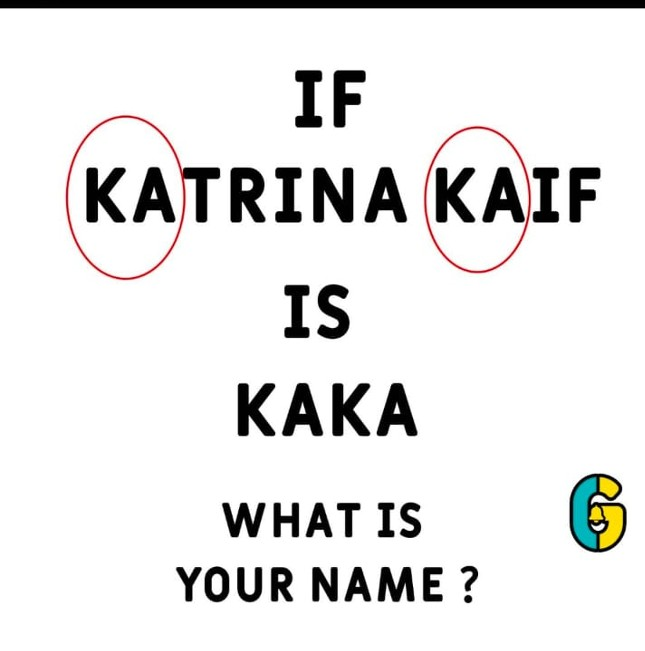
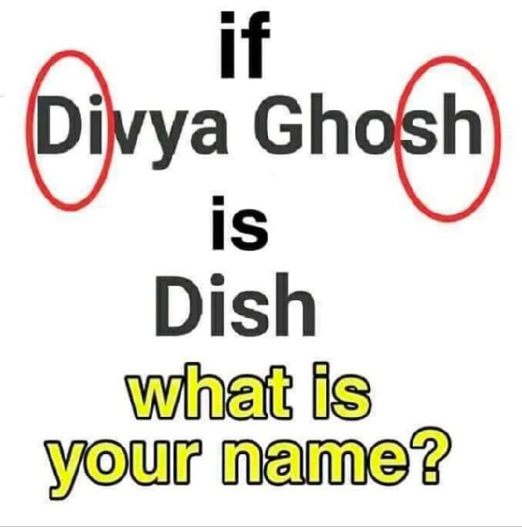
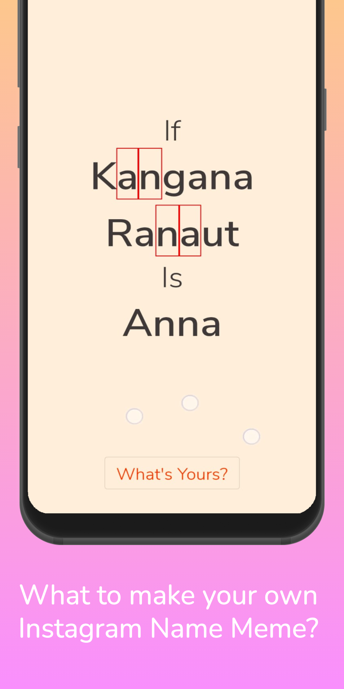
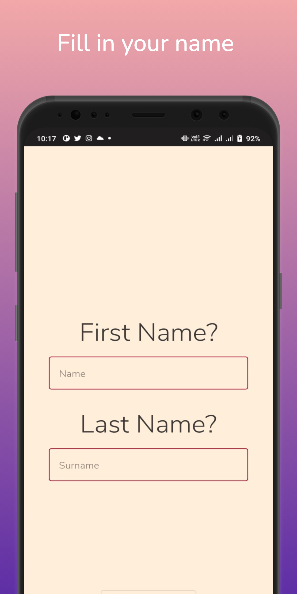
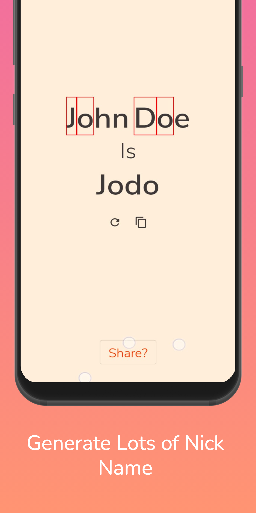
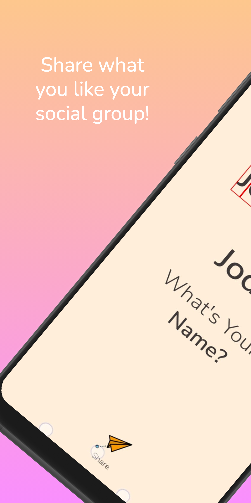

# [Compose-Whatis?](https://chetangupta.net/compose-97/)
A Jetpack Compose App Meme App for knowing you nick name

## Inspiration
You recently might have seen this meme on Instagram, I also did so a sample app idea popped into my head
<table>
<tr>
    <td>
        
    </td>
    <td>
        
    </td>
</tr>
</table>

## Preview
<table>
  <tr>
    <td>
        
    </td>
    <td>
        
    </td>
    <td>
        
    </td>
    <td>
        
    </td>
  </tr>
</table>

## Find on playstore
<a href='https://play.google.com/store/apps/details?id=io.github.ch8n.whatis&pcampaignid=pcampaignidMKT-Other-global-all-co-prtnr-py-PartBadge-Mar2515-1'></a>

## Features
- Generate Nick Name from input names
- Share Image on Social media

## Built With 🛠
- [Kotlin](https://kotlinlang.org/) official programming language for Android development.
- [Jetpack Compose](https://developer.android.com/jetpack/compose) Android’s modern toolkit for building native UI.
    - Jetpack Compose Navigation
    - Compunded Analytics
- Firebase
    - Crashlytics
    - Google Analytics
    - Performance montioring

## Other stuff I build
- [Compose Fruit Ninja 🥝](https://github.com/ch8n/Compose-Fruit-Ninja)
- [Compose Space-Invaders 👾](https://github.com/ch8n/Compose-SpaceWars)
- [3d Batman rain particle system :bat:](https://github.com/ch8n/Compose-Rain)
- [Compose Floaking Ants System(Boids) :ant:](https://github.com/ch8n/Compose-boids-flocking)

## Blog and Portfolio @ [Chetangupta.net](https://chetangupta.net/about)


## Build-tool 🧰
You need to have [Android Studio](https://developer.android.com/studio) to build this project.


## :eyes: Social
[LinkedIn](https://bit.ly/ch8n-linkdIn) | [Medium](https://bit.ly/ch8n-medium-blog) | [Twitter](https://bit.ly/ch8n-twitter) | [StackOverflow](https://bit.ly/ch8n-stackOflow) | [CodeWars](https://bit.ly/ch8n-codewar) | [Portfolio](https://bit.ly/ch8n-home) | [Github](https://bit.ly/ch8n-git) | [Instagram](https://bit.ly/ch8n-insta) | [Youtube](https://bit.ly/ch8n-youtube)


## :cop: License
```
# MIT License

Copyright (c) 2021 Chetan Gupta

Permission is hereby granted, free of charge, to any person obtaining a copy
of this software and associated documentation files (the "Software"), to deal
in the Software without restriction, including without limitation the rights
to use, copy, modify, merge, publish, distribute, sublicense, and/or sell
copies of the Software, and to permit persons to whom the Software is
furnished to do so, subject to the following conditions:

The above copyright notice and this permission notice shall be included in all
copies or substantial portions of the Software.

THE SOFTWARE IS PROVIDED "AS IS", WITHOUT WARRANTY OF ANY KIND, EXPRESS OR
IMPLIED, INCLUDING BUT NOT LIMITED TO THE WARRANTIES OF MERCHANTABILITY,
FITNESS FOR A PARTICULAR PURPOSE AND NONINFRINGEMENT. IN NO EVENT SHALL THE
AUTHORS OR COPYRIGHT HOLDERS BE LIABLE FOR ANY CLAIM, DAMAGES OR OTHER
LIABILITY, WHETHER IN AN ACTION OF CONTRACT, TORT OR OTHERWISE, ARISING FROM,
OUT OF OR IN CONNECTION WITH THE SOFTWARE OR THE USE OR OTHER DEALINGS IN THE
SOFTWARE.
```
